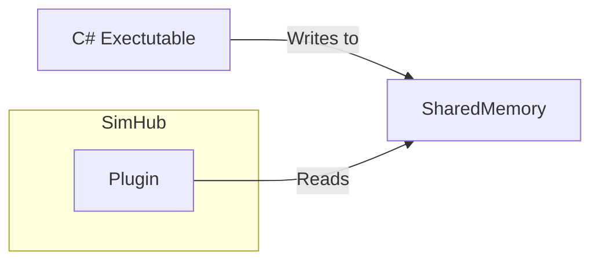

    <h4>F1 Manager 2024 Logger</h1>
    

# FAQ (Frequently Asked Questions)

## Table of Contents
- [FAQ (Frequently Asked Questions)](#faq-frequently-asked-questions)
  - [Table of Contents](#table-of-contents)
    - [How does this plugin work?](#how-does-this-plugin-work)
    - [What is a Shared Memory File (MMF)?](#what-is-a-shared-memory-file-mmf)
      - [How it works](#how-it-works)
      - [Why use a Shared Memory File?](#why-use-a-shared-memory-file)
    - [Can this work for F1 Manager 2022/2023?](#can-this-work-for-f1-manager-20222023)
    - [Can we have additional data points?](#can-we-have-additional-data-points)
    - [Why is the code source of the C# Memory Reader not available?](#why-is-the-code-source-of-the-c-memory-reader-not-available)
    - [Why do I get so many errors in the SimHub Logs?](#why-do-i-get-so-many-errors-in-the-simhub-logs)

---

### How does this plugin work?

The workflow is as follows:

Basically, I use a Custom-Written C# Plugin to read memory from the game, the data is then parsed as JSON and sent into a Shared Memory File, that file is read by the plugin to display that data in SimHub!

### What is a Shared Memory File (MMF)?

A Shared Memory File (MMF) is a mechanism that allows multiple processes to access the same block of memory, enabling efficient data sharing between them. In the context of this plugin, the MMF acts as a bridge between the C# Executable and the SimHub plugin.

#### How it works
1. **C#**: Reads memory from the F1 Manager 2024 game process and extracts relevant data points such as car telemetry, session information, and weather conditions.
2. **Shared Memory File**: Cheat Engine writes this data into the MMF at a high frequency (e.g., 100Hz). The MMF is essentially a binary file that resides in memory and can be accessed by other processes.
3. **SimHub Plugin**: The plugin reads the data from the MMF and parses it into a format that SimHub can use to display dashboards, charts, and other telemetry visualizations.

#### Why use a Shared Memory File?
- **Performance**: MMFs are highly efficient for inter-process communication (IPC) because they avoid the overhead of traditional file I/O or network communication.
- **Real-Time Updates**: The MMF allows data to be updated and accessed in real-time, which is critical for telemetry applications where latency can impact the user experience.
- **Compatibility**: Since Cheat Engine and the SimHub plugin operate in different environments (32-bit vs. 64-bit), the MMF provides a neutral ground for data exchange without requiring direct memory access between the two.
- **Simplicity**: Using an MMF simplifies the architecture by decoupling the data producer (Cheat Engine) from the consumer (SimHub plugin). This modular approach makes the system easier to maintain and extend.

By leveraging a Shared Memory File, the plugin ensures smooth and efficient communication between the game and SimHub, enabling users to access detailed telemetry data in real-time.

### Can this work for F1 Manager 2022/2023?

I honestly have no idea. I have not yet tried, I want to finish building the plugin for F1 Manager 2024 first, then focus on making it compatible with the other titles.

### Can we have additional data points?

Finding new data points inside the game is a long and tedious process. I have to manually scan the memory of the game, change the desired value, and look up if anything has changed in the memory. This makes certain data points that change spots in memory almost impossible to get. I am obviously always working on obtaining more, and when I do, I add them to the script.

If you have data points to request that I may have forgotten about, please feel free to do so, and I'll try to find them.

### Why is the code source of the C# Memory Reader not available?

This code, if used maliciously and reuploaded by someone else, could have devastating impact on your machine, deleting files, stealing or information...
This is why I've chosen to keep this code Closed-Source, so that it can't be redistributed with malicious intents.

### Why do I get so many errors in the SimHub Logs?

The data is being updated at a frequency of 100Hz, why? Because I need to account for the game maybe running at 16x speed, and I need to be able to read the data at that speed.
This means that the plugin is constantly reading the data, and if SimHub is not able to keep up with the data, it will throw errors in the logs.

This is normal, and you can ignore it. The plugin will still work as intended, and the data will be updated correctly.

Theorically, it could mess up the Historical Data, but the chances of that type of error happening exactly when a turn or lapped is being logged are second to none.